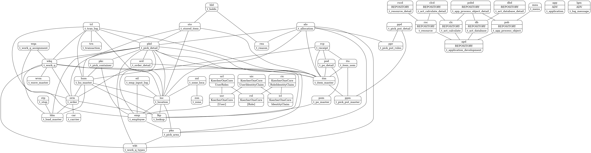

# Koerber Snippets

This is a project to generate useful SQL snippets for Koerber development, specifically for AAD database.


## Install

Go to the [release page](https://github.com/derekvance21/koerber-snippets/releases) and download the appropriate file for your IDE (SSMS or VSCode/Azure Data Studio).

### VSCode/Azure Data Studio

[docs](https://code.visualstudio.com/docs/editor/userdefinedsnippets#_create-your-own-snippets)

1. Open the Command Palette with `Ctrl+Shift+P` and search for and select `Snippets: Configure Snippets`, then `MS SQL`
2. Copy the downloaded `sql.json` file and paste it into this opened buffer and save.
3. Alternatively, move the downloaded `sql.json` file to `%APPDATA%\Code\User\snippets` for VSCode or `%APPDATA%\azuredatastudio\User\snippets` for Azure Data Studio.
4. Open a new buffer, change the language to SQL, type `stopkd`, then hit `Enter` to test snippet expansion.

### SSMS

[docs](https://learn.microsoft.com/en-us/sql/ssms/scripting/add-transact-sql-snippets?view=sql-server-ver16)

1. Open the Code Snippets Manager with `Ctrl+K, Ctrl+B` or clicking `Tools > Code Snippets Manager`.
2. Click `Add` and add a folder where you're going to put the downloaded `.snippet` file. I would name it something that would show up first in an alphabetical list (like `AAD` or `.Koerber`) because of the way snippets work in SSMS.
3. Click `Import` and select the downloaded `.snippet` file. 
4. Select the folder you created and click `Finish` (this may take a few moments) and then hit `OK`.
5. To open the available snippets, use the shortcut `Ctrl+K,  Ctrl+X`. Select (by pressing `Enter`) the folder you added (you want it to be first in the list so that you don't have to search for it!), type `stopkd`, then hit `Enter`. The `stopkd` `JOIN` snippet expansion should work correctly.

## Background

Here is a graph of a subset of the AAD schema that these snippets use. Each node is a table, and each relationship between two tables is an edge. Each node has a unique default alias. Each edge has a join attribute describing how one table joins to the other table's primary key.



Using some graph algorithms, the shortest paths from a source node to a set of destination nodes can be found.

## Snippets

SSMS and Azure Data Studio (also VSCode) support custom snippets.

### FROM Snippet

Each table in the schema can expand a table alias snippet to a `FROM` line with the table name and `WITH (NOLOCK)`. So `sto` expands to:
```sql
FROM t_stored_item sto WITH (NOLOCK)
```

### JOIN Snippet

Here is the cool part. Type up to three table aliases, and a snippet is created that is *a* shortest set of paths from the first alias to the other two aliases. For example, `stohumloc` would expand to:
```sql
JOIN t_hu_master hum WITH (NOLOCK)
	ON sto.wh_id = hum.wh_id
	AND sto.hu_id = hum.hu_id
JOIN t_location loc WITH (NOLOCK)
	ON sto.wh_id = loc.wh_id
	AND sto.location_id = loc.location_id
```
Because the two edges from `sto` to `hum` and from `sto` to `loc` is *a* shortest set of paths starting at `sto` that visits both `hum` and `loc`.

Typing `zonsto` would expand to:
```sql
JOIN t_zone_loca znl WITH (NOLOCK)
	ON zon.wh_id = znl.wh_id
	AND zon.zone = znl.zone
JOIN t_location loc WITH (NOLOCK)
	ON znl.wh_id = loc.wh_id
	AND znl.location_id = loc.location_id
JOIN t_stored_item sto WITH (NOLOCK)
	ON loc.wh_id = sto.wh_id
	AND loc.location_id = sto.location_id
```
Because *a* shortest path from `zon` to `sto` is through `znl` and `loc`.

You have to be careful, though, because there can be multiple shortest paths from a source to a set of destinations. For example, say you wanted to find all the `sto` on each employee's fork. So you could try `stoemp`, but you'd get:
```sql
JOIN t_pick_detail pkd WITH (NOLOCK)
	ON sto.type = pkd.pick_id
JOIN t_employee emp WITH (NOLOCK)
	ON pkd.user_assigned = emp.id
```
Joining through pkd is probably not what you want. So you can "refine" the snippet by specifying another table you want involved. So a fork is a location (`loc`), so you can insert `loc` in the middle or end of the snippet, and now `stolocemp` gives you:
```sql
JOIN t_location loc WITH (NOLOCK)
	ON sto.wh_id = loc.wh_id
	AND sto.location_id = loc.location_id
JOIN t_employee emp WITH (NOLOCK)
	ON loc.c1 = emp.id
```
Because now a shortest set of paths from `sto` to `loc` and `emp` is through those two tables.

### Others

The snippet `btran` begins a transaction *that is potentially inside another transaction and with proper error handling*. A lot of base code does not do this properly.

The snippet `ifelse` expands to `IF`/`ELSE` blocks.

Then there are two easter egg snippets, `dragon` and `dragoncow`.

## Build

The following generates two snippet files in the `out/` folder: `sql.json` (for VSCode/Azure Data Studio) and `snippets.snippet` (for SSMS).
```sh
mkdir -p out; clj -M -m snippets.core
```
